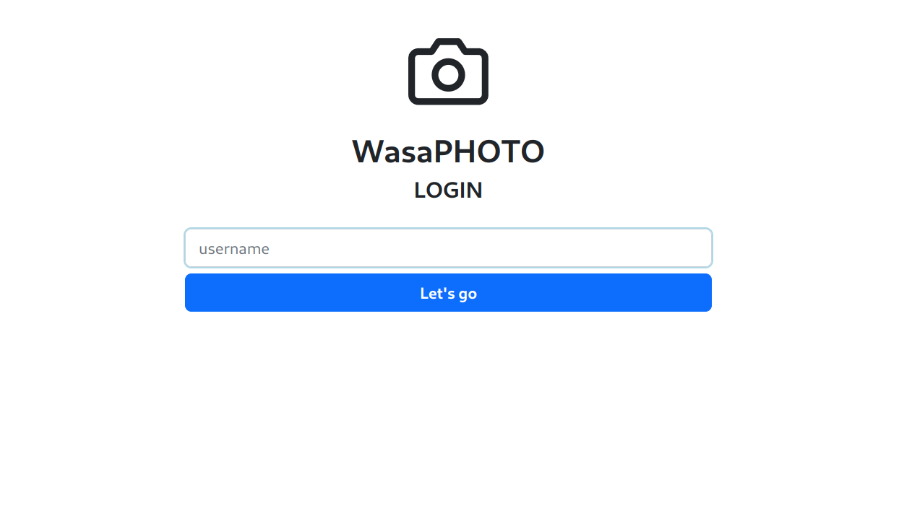
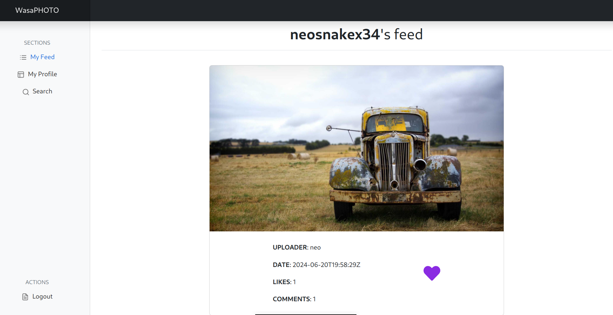
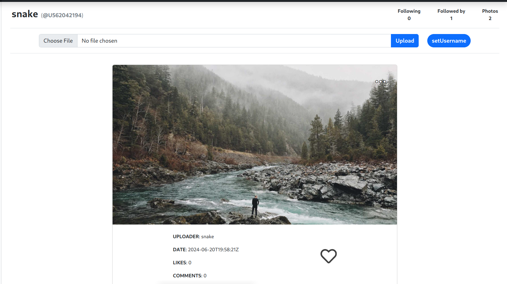
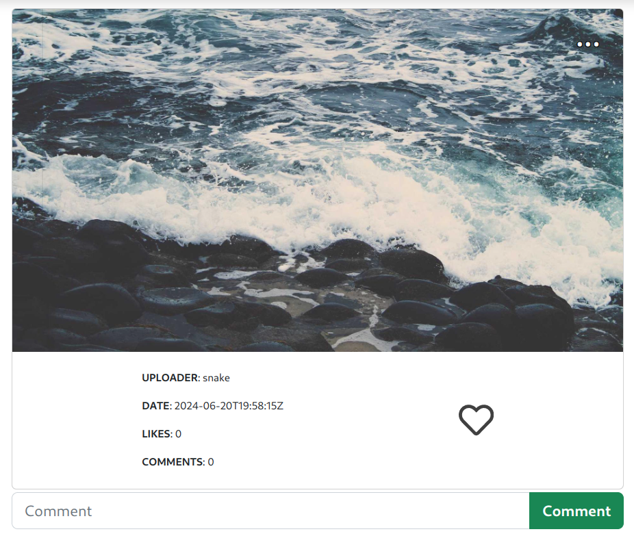

# Source code for neoSnakex34's WASAPhoto  

## What am I looking at? 

This is a project made during my WASA (web and software architecture) course; now that i took the exam i made the source code public as a demo of what i did. 

It aims to provide an experience similar to those you can have in any of the most famous photo sharing social networks. 
WASAPhoto (graphically *WasaPHOTO*) is a single page WebApp implementing a **REST** API. 

* **OPENAPI** specs can be found at `doc/api.yaml`.
* API implementation and **BACKEND** features are implemented using **Go** and can be found in `service/`.
* Users will use API functions through a **FRONTEND** UI made with **Vue.js**, aesthetically appealing and easy to use. Source found in `webui/`. 
* Deployment is made using **Docker** containers. Check the two `Dockerfile.*` in the project root.

## Some demo screenshots
login page


user feed


user profile


post details


## How to build

If you're not using the WebUI, or if you don't want to embed the WebUI into the final executable, then:

```shell
go build ./cmd/webapi/
```

If you're using the WebUI and you want to embed it into the final executable:

```shell
./open-npm.sh
# (here you're inside the NPM container)
npm run build-embed
exit
# (outside the NPM container)
go build -tags webui ./cmd/webapi/
```

## How to run (in development mode)

You can launch the backend only using:

```shell
go run ./cmd/webapi/
```

If you want to launch the WebUI, open a new tab and launch:

```shell
./open-npm.sh
# (here you're inside the NPM container)
npm run dev
```

## How to run using containers 

First you should build the two images: 

```shell
docker build -t wasaphoto-backend:latest -f Dockerfile.backend .
```

```shell
docker build -t wasaphoto-frontend:latest -f Dockerfile.frontend .
```

Then you can run them _(changing flags if you need, rm will delete everything after you exit the container)_

```shell
docker run -it --rm -p 3000:3000 wasaphoto-backend:latest
```

```shell
docker run -it --rm -p 8081:80 wasaphoto-frontend:latest
```

## NOTE: on image licensing 
In this repo you can find a folder called _samples_ with some sample photos downloaded via unsample (api for downloading stock photo via unsplash) 
those photos _should_ be royalty free and open, **but** I'm using them just for demo purposes, all rights are reserved to photo original owner, and those pics are NOT distributed via MIT license in this project.

